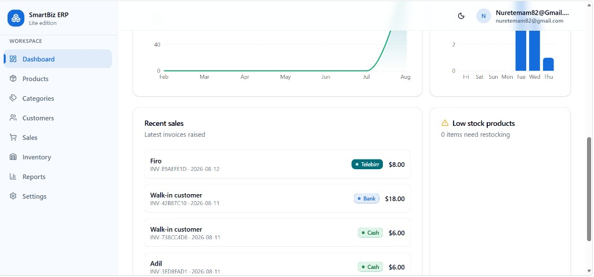
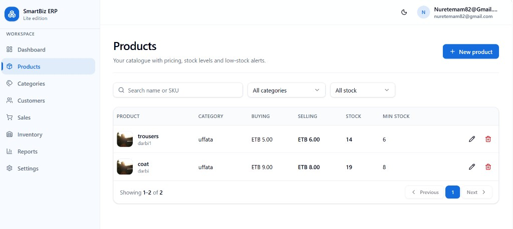
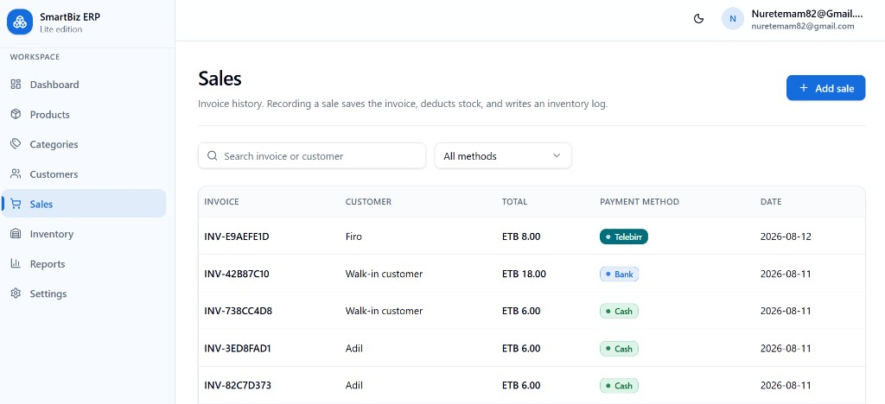
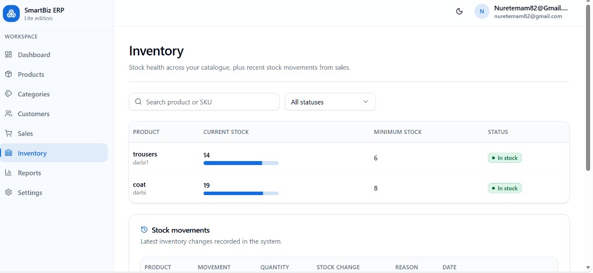

# SmartBiz ERP Lite

Lightweight inventory and sales management for small and medium businesses — built as a modern React frontend on an existing Supabase backend.

**Repository:** [github.com/Nure-Tem/smartbiz-frontend](https://github.com/Nure-Tem/smartbiz-frontend)

| Area | Stack |
| --- | --- |
| UI | React 19 · TypeScript · Vite · Tailwind CSS · shadcn/ui |
| Data | TanStack Query · Supabase |
| Routing | TanStack Router · TanStack Start |
| Forms | React Hook Form · Zod |
| Charts | Recharts |

---

## Overview

SmartBiz ERP Lite is a focused ERP workspace for day-to-day retail and wholesale operations. It covers catalogue management, stock health, customer records, invoicing, and basic business settings — with role-aware access for admins and cashiers.

The application is intended for teams that need a clean, browser-based tool for:

- Tracking products and categories
- Recording sales and deducting stock
- Monitoring inventory movements
- Managing customers and payment methods (including Telebirr)
- Viewing dashboard and report summaries

---

## Core Features

| Feature | Description |
| --- | --- |
| **Dashboard** | Sales trends, recent invoices, and low-stock overview |
| **Products** | Catalogue with pricing, SKU, stock levels, and low-stock thresholds |
| **Categories** | Organize products into categories |
| **Customers** | Customer records with Ethiopian phone normalization |
| **Sales** | Create invoices, choose payment method, deduct stock, write inventory logs |
| **Inventory** | Stock health across the catalogue and recent stock movements |
| **Reports** | Analytics views backed by live sales and inventory data |
| **Settings** | Business settings (e.g. currency) for admins |
| **Authentication** | Supabase Auth — sign in, register, password recovery, auth callback |
| **Roles** | `admin` and `cashier` from the `profiles` table, with UI gating |

**Payment methods supported in the app:** Cash, Bank, Credit, Telebirr.

---

## Technology Stack

Verified from `package.json` and source:

- **React** 19 + **TypeScript**
- **Vite** 8
- **Tailwind CSS** 4
- **shadcn/ui** (Radix primitives)
- **TanStack Router** + **TanStack Start**
- **TanStack Query**
- **React Hook Form** + **Zod** (+ `@hookform/resolvers`)
- **Lucide React**
- **Recharts**
- **Supabase JS** (`@supabase/supabase-js`)
- **Sonner** (toasts)

> Routing uses **TanStack Router** (`@tanstack/react-router`, `src/routeTree.gen.ts`). This project does **not** use React Router.

---

## Architecture

High-level frontend layout:

```
Browser
  └── TanStack Start / Vite app
        ├── Routes (file-based, TanStack Router)
        ├── Layouts (app shell, auth shell)
        ├── Hooks (auth, theme, mobile)
        ├── API utilities (Supabase table access)
        ├── Query definitions (TanStack Query)
        └── UI (shadcn/ui + shared common components)
              └── Supabase (Auth + Postgres)
```

- **Routes** — file-based routes under `src/routes/`; the generated tree is `src/routeTree.gen.ts`
- **Layouts** — `AppLayout` for the authenticated workspace; `AuthLayout` for login/register/forgot-password
- **Auth** — session via Supabase Auth; profile/role loaded from `profiles`
- **API** — thin clients in `src/lib/api/*` for products, categories, customers, sales, inventory, settings, profiles
- **Styling** — Tailwind CSS + CSS variables; theme toggle (light/dark)

---

## Project Structure

```
smartbiz-frontend/
├── docs/
│   └── screenshots/          # README product screenshots
├── public/
│   ├── logo.png              # Full SmartBiz lockup (dark)
│   ├── logo-light.png        # Full lockup for light backgrounds
│   ├── logo-icon.png         # App icon (primary)
│   ├── logo-icon-dark.png    # Icon for dark panels
│   ├── favicon.ico / .png    # Browser favicon (symbol only)
│   └── apple-touch-icon.png
├── src/
│   ├── components/
│   │   ├── common/           # Page header, tables, empty/error states
│   │   ├── layout/           # App + auth layouts
│   │   └── ui/               # shadcn/ui primitives
│   ├── hooks/                # useAuth, useTheme, etc.
│   ├── lib/
│   │   ├── api/              # Supabase data access
│   │   ├── auth.ts           # Auth helpers
│   │   ├── queries.ts        # TanStack Query options
│   │   ├── route-guards.ts   # requireAuth / redirectIfAuthenticated
│   │   └── supabase.ts       # Supabase client
│   ├── routes/               # TanStack Router pages
│   ├── router.tsx
│   ├── routeTree.gen.ts      # Generated route tree
│   ├── styles.css
│   └── start.ts
├── package.json
└── README.md
```

---

## Authentication & Authorization

- **Provider:** Supabase Auth (email/password flows; auth callback route at `/auth/callback`)
- **Profile source:** `profiles` table (role, name, phone, avatar)
- **Roles:**
  - **admin** — full workspace access including Settings; can delete catalogue records where the UI allows it
  - **cashier** — operational access (sales, catalogue viewing/editing as gated); Settings is hidden
- **Guards:** `requireAuth` and `redirectIfAuthenticated` in `src/lib/route-guards.ts` run in route `beforeLoad`

Permissions are enforced in the UI based on `profiles.role`. Database RLS policies live in the existing Supabase project (not defined in this frontend repo).

---

## Database

Tables used by the frontend (confirmed via `src/lib/api/*` and auth):

| Table | Purpose |
| --- | --- |
| `profiles` | User profile and role (`admin` / `cashier`) |
| `categories` | Product categories |
| `products` | Catalogue, pricing, `current_stock`, `minimum_stock` |
| `customers` | Customer records |
| `sales` | Invoices / sales headers |
| `sale_items` | Line items for each sale |
| `inventory_logs` | Stock movement history |
| `settings` | Business settings (e.g. currency) |

Schema ownership remains in the existing Supabase project. This repository does not ship SQL migrations.

---

## Environment Variables

Create a `.env` (or `.env.local`) in the project root:

```env
VITE_SUPABASE_URL=https://your-project.supabase.co
VITE_SUPABASE_ANON_KEY=your-anon-key
```

| Variable | Description |
| --- | --- |
| `VITE_SUPABASE_URL` | Supabase project URL |
| `VITE_SUPABASE_ANON_KEY` | Supabase anonymous (public) key |

Never commit real credentials. Use the anon key only; do not put the service role key in the frontend.

---

## Getting Started

### Prerequisites

- Node.js 20+ (recommended)
- npm
- Access to the existing Supabase project

### Setup

```bash
git clone https://github.com/Nure-Tem/smartbiz-frontend.git
cd smartbiz-frontend
npm install
```

Copy environment variables as shown above, then start the app:

```bash
npm run dev
```

Open the local URL printed by Vite (typically `http://localhost:3000` or similar).

---

## Development Commands

Scripts from `package.json`:

| Command | Description |
| --- | --- |
| `npm run dev` | Start the Vite development server |
| `npm run build` | Production build |
| `npm run build:dev` | Build in development mode |
| `npm run preview` | Preview the production build |
| `npm run lint` | Run ESLint |
| `npm run format` | Format with Prettier |

> There is no dedicated `typecheck` script. Type checking is available via the TypeScript compiler (`npx tsc --noEmit`) if needed.

---

## Production Build

```bash
npm run build
```

Output is produced by Vite / TanStack Start into the project build directories (e.g. `.output`). Ensure `VITE_SUPABASE_URL` and `VITE_SUPABASE_ANON_KEY` are set in the build environment.

---

## Screenshots

### Dashboard



### Products



### Sales



### Inventory



---

## Development Principles

- **Type safety** — TypeScript throughout routes, API clients, and forms
- **Reusable UI** — shared layout, common table/search components, and shadcn/ui primitives
- **Responsive layout** — sidebar + mobile sheet navigation
- **Existing backend** — integrate with the current Supabase schema; do not invent parallel databases
- **Secure auth patterns** — session-based access with fail-closed profile/role loading
- **Maintainable structure** — clear separation of routes, layouts, hooks, and API utilities

---

## Project Status

Active ERP frontend under ongoing refinement. Core inventory, sales, customers, and auth flows are implemented against a live Supabase backend. Treat production deployment as an operational concern (env, hosting, RLS review) rather than “fully production-ready out of the box.”

---

## Roadmap

Future ideas (not yet implemented):

- Advanced sales analytics and printable/PDF invoices
- CSV / Excel exports
- Richer inventory reporting and audit trails
- In-app notifications
- More granular permissions beyond admin/cashier
- Deployment and CI improvements

---

## License

No open-source license file is published in this repository. All rights reserved by the project owner unless otherwise stated.

Copyright © 2026 SmartBiz ERP Lite.
